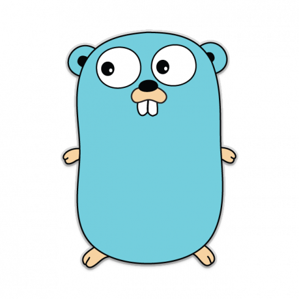

<h1 align="center">Hi there! I'm a MrSnakeDoc </h1>

<h2 align="center">Backend Developer | DevOps-In-Progress | Golang Convert 🚀</h2>

  Welcome to my homelab and development space — where backend services are built with care, infrastructure is self-hosted and evolving, and learning never stops.

---

### 🧠 About Me

I'm a backend developer with a strong foundation in Node.js and TypeScript, currently transitioning to Golang to build faster, more efficient, and scalable systems.  

I'm passionate about designing resilient backend architectures, automating deployments, and crafting robust self-hosted infrastructure through hands-on experience in my homelab.

With a growing focus on DevOps practices, I'm diving deeper into cloud infrastructure, container orchestration, networking, and observability — always aiming to understand, optimize, and evolve my stack.

---

### 🏠 Homelab & Experimentation

This is my playground — functional, self-hosted, and probably overengineered:

- 🐳 Running a Docker-based microservice architecture
- ⚡ Traefik as a reverse proxy with automated TLS
- 🕵️‍♂️ Cloudflare Tunnels (Zero Trust setup) for secure remote access
- 📈 Monitoring stack: Grafana, Prometheus, Node Exporter, cAdvisor
- 🔐 AdGuardHome for local DNS and blocking nonsense
- 💾 Synology NAS + Router handling media, storage, and local DNS + VPN
- 🧱 Hosted services: Gitea, Drone CI, Gotify, Uptime Kuma, Mealie, Overseerr, Outline, Homepage
- 🧪 Everything runs on a Proxmox-powered lab with Docker on Ubuntu

> ⚠️ **Kubernetes (K3s)** is part of the plan, not part of the stack — yet.

---

### 💻 Developer Side

I build backends with modern JavaScript and TypeScript, and I'm shifting more and more towards writing services and tools in **Go**, because it brings the right balance of simplicity and performance.

- 🧠 Passionate about clean architecture, modularity, and writing testable code
- 🧰 Tools: Node.js, Express/Fastify, Go (net/http, gin, cobra, etc.)
- 📦 Package-first mindset — I love building reusable helpers and avoiding monolith logic
- 💣 Avoids loops like the plague — prefers array methods and composition
- 🧪 TDD (when coffee levels are high)

---

### 🛠 Skills & Tools

- 🐳 Docker pro — from basic containers to orchestrated service networks
- 🧑‍💻 Linux server management & self-hosting wizardry
- 🧬 CI/CD with GitHub Actions, Drone CI
- 🔌 Networking, VPNs (OpenVPN, Zero Trust), DNS configs
- 📚 Relational (PostgreSQL,MySQL) & NoSQL (MongoDB, Redis) DBs
- 🧪 Monitoring & observability enjoyer
- ✨ Obsessed with clean code, DRY/SOLID principles, and not repeating my bugs

---

### 📈 Planning & Goals

- 🚀 Transition homelab to K3s
- 🤖 Automate infra with Ansible and GitHub Actions
- 🧠 Keep learning Go — especially for tooling and microservices
- 🔍 Explore high availability, disaster recovery and backup strategies
- 💡 Contribute to open-source DevOps and backend projects
- ☁️ Get certified as a cloud sysadmin and network admin

---

  Building the backend of tomorrow, one crashing container at a time. Let's connect! 
  

